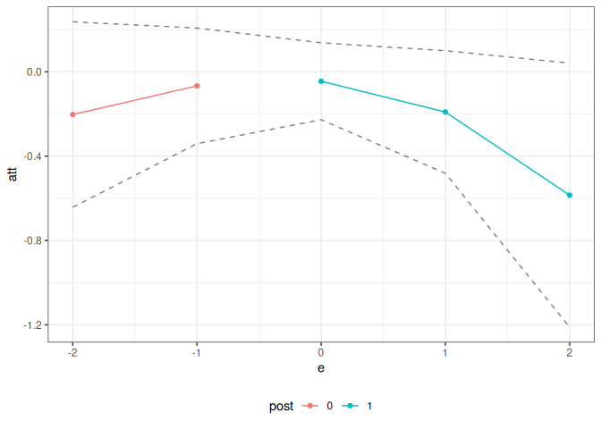

<!-- README.md is generated from README.Rmd. Please edit that file -->

# contdid

<!-- badges: start -->
<!-- badges: end -->

An R package for difference-in-differences with a continuous treatment.

## Installation

You can install the development version of contdid from
[GitHub](https://github.com/) with:

``` r
# install.packages("devtools")
devtools::install_github("bcallaway11/contdid")
#> Using GitHub PAT from the git credential store.
#> Downloading GitHub repo bcallaway11/contdid@HEAD
#> 
#> ── R CMD build ─────────────────────────────────────────────────────────────────
#> * checking for file ‘/tmp/RtmpnowXfn/remotes3e91d1321c0d0/bcallaway11-contdid-e8b692b01297be608521a9b1923f3f0be8ba7e4f/DESCRIPTION’ ... OK
#> * preparing ‘contdid’:
#> * checking DESCRIPTION meta-information ... OK
#> * checking for LF line-endings in source and make files and shell scripts
#> * checking for empty or unneeded directories
#> Omitted ‘LazyData’ from DESCRIPTION
#> * building ‘contdid_0.0.001.tar.gz’
#> Installing package into '/tmp/RtmpHmmUG1/temp_libpath3e4393ecc1b27'
#> (as 'lib' is unspecified)
```

## Example

This is a basic example which shows you how to solve a common problem:

``` r
library(contdid)

devtools::load_all("~/Dropbox/contdid")
#> ℹ Loading contdid
#> Registered S3 methods overwritten by 'ptetools':
#>   method                    from
#>   print.group_time_att      pte 
#>   print.pte_results         pte 
#>   print.summary.pte_results pte 
#>   summary.group_time_att    pte 
#>   summary.pte_emp_boot      pte 
#>   summary.pte_results       pte
# Simulate data
set.seed(123)
sp <- did::reset.sim()
df <- did::build_sim_dataset(sp)
n <- length(unique(df$id))
D <- runif(n, 0, 1)
# make some untreated units
df$D <- BMisc::time_invariant_to_panel(D, df, "id")
# df$D <- df$D * (df$period >= df$G) * (df$G != 0)
# df <- df[, c("id", "period", "Y", "D")]
cd_res <- cont_did(
  yname = "Y",
  tname = "period",
  idname = "id",
  dname = "D",
  data = df,
  gname = "G",
  target_parameter = "slope",
  aggregation = "dose",
  treatment_type = "continuous",
  control_group = "notyettreated",
  biters = 10,
  cl = 10,
  knots = 3,
  degree = 3
)
#> Warning in cont_did(yname = "Y", tname = "period", idname = "id", dname = "D",
#> : clustered standard errors not tested yet, may not work

ggpte(cd_res)
```


