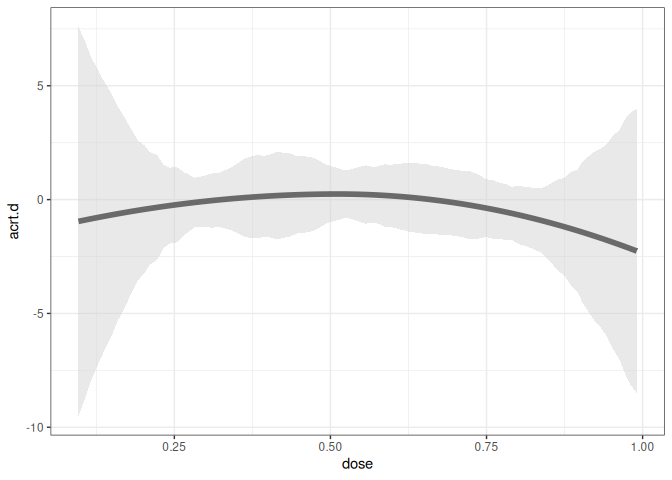

<!-- README.md is generated from README.Rmd. Please edit that file -->

# contdid

<!-- badges: start -->
<!-- badges: end -->

An R package for difference-in-differences with a continuous treatment.

## Installation

You can install the development version of contdid from
[GitHub](https://github.com/) with:

``` r
# install.packages("devtools")
devtools::install_github("bcallaway11/contdid")

library(contdid)
```

## Example

This is a basic example which shows you how to solve a common problem:

``` r
# Simulate data
set.seed(123)
sp <- did::reset.sim()
df <- did::build_sim_dataset(sp)
n <- length(unique(df$id))
D <- runif(n, 0, 1)
# add treatment variable
df$D <- BMisc::time_invariant_to_panel(D, df, "id")
cd_res <- cont_did(
  yname = "Y",
  tname = "period",
  idname = "id",
  dname = "D",
  data = df,
  gname = "G",
  target_parameter = "slope",
  aggregation = "dose",
  treatment_type = "continuous",
  control_group = "notyettreated",
  biters = 100,
  #  cl = 10,
  cband = TRUE,
  num_knots = 1,
  degree = 3,
  # dvals = seq(.4, .6, length.out = 20)
)

ggcont_did(cd_res, type = "acrt")
```


