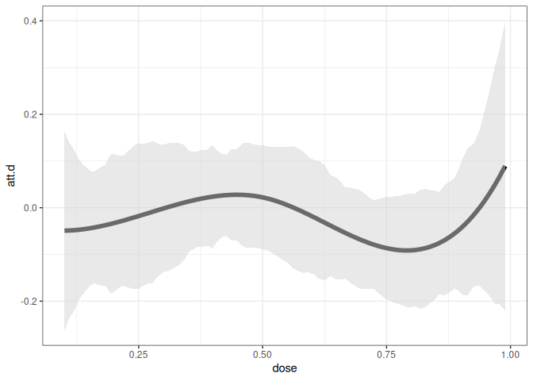

<!-- README.md is generated from README.Rmd. Please edit that file -->

# contdid

<!-- badges: start -->
<!-- badges: end -->

An R package for difference-in-differences with a continuous treatment.

## Installation

You can install the development version of contdid from
[GitHub](https://github.com/) with:

``` r
# install.packages("devtools")
devtools::install_github("bcallaway11/contdid")

library(contdid)
```

## Conceptual Setup

Below, we give several examples of how to estimate causal effect
parameters using the `cont_did` package.

At a high level, the interface is basically the same as for the `did`
package and for other packages that rely on the `ptetools` backend, with
only a few pieces of additional information being required. First, the
name of the continuous treatment variable should be passed through the
`dname` argument.

The `cont_did` function expects the continuous treatment variable to
behave in certain ways:

1.  It needs to be time-invariant.

2.  It should be set to its time-invariant value in pre-treatment
    periods. This is just a convention of the package, but, in
    particular, you should not have the treatment variable coded as
    being 0 in pre-treatment periods.

3.  For units that don’t participate in the treatment in any time
    period, the treatment variable just needs to be time-invariant. In
    some applications, e.g., the continuous treatment variable may be
    defined for units that don’t actually participate in the treatment.
    In other applications, it may not be defined for units that do not
    participate in the treatment. The function behaves the same way in
    either case.

Next, the other important parameters are `target_parameter`,
`aggregation`, and `treatment_type`:

- `target_parameter` can either be “level” or “slope”. If “level”, then
  the function will calculate `ATT` parameters. If set to be “slope”,
  then the function will calculate `ACRT` parameters—these are causal
  response parameters that are derivatives of the `ATT` parameters. Our
  paper [Callaway, Goodman-Bacon, and Sant’Anna
  (2024)](https://arxiv.org/abs/2107.02637) points out some
  complications for interpreting these derivative type parameters under
  the most commonly invoked version of the parallel trends assumption.

- `aggregation` can either by “eventstudy” or “dose”. For “eventstudy”,
  depending on the value of the `target_parameter` argument, the
  function will provide either the average `ATT` across different event
  times or the average `ACRT` across different event times. For “dose”,
  the function will average across all time periods and report average
  affects across different values of the continuous treatment. For the
  “dose” aggregation, results are calculated for both `ATT` and `ACRT`
  and can be displayed by providing different arguments to plotting
  functions (see example below).

- `treatment_type` can either be “continuous” or “discrete”. Currently
  only “continuous” is supported. In this case, the code proceeds as if
  the treatment really is continuous. The estimate are computed
  nonparametrically using B-splines. The user can control the number of
  knots and the degree of the B-splines using the `num_knots` and
  `degree` arguments. The defaults are `num_knots=0` and `degree=1`
  which amounts to estimating `ATT(d)` by estimating a linear model in
  the continuous treatment among treated units and subtracting the
  average outcome among the comparison units.

## Examples

With a continous treatment, the underlying building blocks are treatment
effects that are local to a particular timing group `g` in a particular
time period `t` that experienced a particular value of the treatment
`d`. These treatment affects are relatively high-dimensional, and most
applications are likely to involve aggregating/combining these
underlying parameters. We focus on aggregations that (i) average across
timing-groups and time periods to given average treatment effect
parameters as a function of the dose `d` or (ii) averages across doses
and partially across timing group and time periods in order to give
event studies.

For the results below, we will simulate some data, where the continuous
treatment `D` has no effect on the outcome.

``` r
# Simulate data
set.seed(123)
# baseline simulation parameters
sp <- did::reset.sim()
# adjust some default simulation parameters
sp$n <- 10000 # increase number of units
sp$bett <- sp$betu <- sp$te.bet.X <- rep(0, length(sp$bett)) # no effects of covariates
sp$te <- 0 # the effect of the treatment is 0
df <- did::build_sim_dataset(sp)
n <- length(unique(df$id))
D <- runif(n, 0, 1)
# add treatment variable, it is fully independent of everything else
df$D <- BMisc::time_invariant_to_panel(D, df, "id")
head(df)
#> # A tibble: 6 × 8
#>       G      X    id cluster period     Y treat      D
#>   <dbl>  <dbl> <int>   <int>  <dbl> <dbl> <dbl>  <dbl>
#> 1     4 -0.560     1      19      1  2.47     1 0.548 
#> 2     4 -0.560     1      19      2  5.23     1 0.548 
#> 3     4 -0.560     1      19      3  6.20     1 0.548 
#> 4     4 -0.560     1      19      4  6.29     1 0.548 
#> 5     3  1.56      3      16      1  2.63     1 0.0237
#> 6     3  1.56      3      16      2  4.21     1 0.0237
```

### Case 1: Dose Aggregation

The following code can be used to estimate the `ATT(d)` and `ACRT(d)`
parameters for the continuous treatment `D` using the `cont_did`
function. The `aggregation` argument is set to “dose” and the
`target_parameter` argument is set to “level” for `ATT(d)` and “slope”
for `ACRT(d)`.

``` r
cd_res <- cont_did(
  yname = "Y",
  tname = "period",
  idname = "id",
  dname = "D",
  data = df,
  gname = "G",
  target_parameter = "slope",
  aggregation = "dose",
  treatment_type = "continuous",
  control_group = "notyettreated",
  biters = 100,
  cband = TRUE,
  num_knots = 1,
  degree = 3,
)

summary(cd_res)
#> 
#> Overall ATT:  
#>     ATT    Std. Error     [ 95%  Conf. Int.] 
#>  0.0067         0.027    -0.0461      0.0596 
#> 
#> 
#> Overall ACRT:  
#>    ACRT    Std. Error     [ 95%  Conf. Int.] 
#>  0.0376        0.0532    -0.0667      0.1419 
#> ---
#> Signif. codes: `*' confidence band does not cover 0
ggcont_did(cd_res, type = "att")
```



``` r
ggcont_did(cd_res, type = "acrt")
```


### Case 2: Event Study Aggregations

Next, we consider event study aggregations. The first is event study
aggregation for `ATT`. The second is event study aggregation for `ACRT`.

**Event study aggregation for `ATT`:**

Notice that the target parameter is set `level` to target ATT, and the
`aggregation` argument is set to `eventstudy`.

``` r
cd_res_es_level <- cont_did(
  yname = "Y",
  tname = "period",
  idname = "id",
  dname = "D",
  data = df,
  gname = "G",
  target_parameter = "level",
  aggregation = "eventstudy",
  treatment_type = "continuous",
  control_group = "notyettreated",
  biters = 100,
  cband = TRUE,
  num_knots = 1,
  degree = 3,
)

summary(cd_res_es_level)
#> 
#> Overall ATT:  
#>     ATT    Std. Error     [ 95%  Conf. Int.] 
#>  0.0121        0.0192    -0.0255      0.0497 
#> 
#> 
#> Dynamic Effects:
#>  Event Time Estimate Std. Error   [95%  Conf. Band] 
#>          -2  -0.0965     0.0410 -0.2054      0.0124 
#>          -1   0.0339     0.0256 -0.0341      0.1019 
#>           0   0.0091     0.0207 -0.0457      0.0639 
#>           1   0.0149     0.0246 -0.0504      0.0803 
#>           2   0.0058     0.0381 -0.0953      0.1070 
#> ---
#> Signif. codes: `*' confidence band does not cover 0
ggcont_did(cd_res_es_level)
```


**Event study aggregation for `ACRT`:**

Relative to the previous code, notice that the target parameter is set
`slope` to target ACRT.

``` r
cd_res_es_slope <- cont_did(
  yname = "Y",
  tname = "period",
  idname = "id",
  dname = "D",
  data = df,
  gname = "G",
  target_parameter = "slope",
  aggregation = "eventstudy",
  treatment_type = "continuous",
  control_group = "notyettreated",
  biters = 100,
  cband = TRUE,
  num_knots = 1,
  degree = 3,
)

summary(cd_res_es_slope)
#> 
#> Overall ACRT:  
#>     ATT    Std. Error     [ 95%  Conf. Int.] 
#>  0.0376        0.0435    -0.0477      0.1229 
#> 
#> 
#> Dynamic Effects:
#>  Event Time Estimate Std. Error   [95%  Conf. Band] 
#>          -2   0.0723     0.0510 -0.0656      0.2102 
#>          -1   0.0036     0.0607 -0.1604      0.1676 
#>           0   0.0862     0.0476 -0.0426      0.2150 
#>           1   0.0448     0.0676 -0.1381      0.2277 
#>           2   0.0457     0.1139 -0.2622      0.3537 
#> ---
#> Signif. codes: `*' confidence band does not cover 0
ggcont_did(cd_res_es_slope)
```


