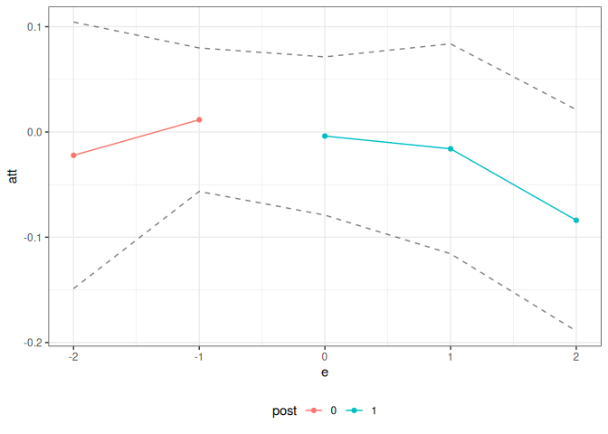

<!-- README.md is generated from README.Rmd. Please edit that file -->

# contdid

<!-- badges: start -->
<!-- badges: end -->

An R package for difference-in-differences with a continuous treatment.

## Installation

You can install the development version of contdid from
[GitHub](https://github.com/) with:

``` r
# install.packages("devtools")
devtools::install_github("bcallaway11/contdid")

library(contdid)
```

## Example

To start with, we will simulate some data, where the continuous
treatment `D` has no affect on the outcome.

``` r
# Simulate data
set.seed(123)
sp <- did::reset.sim()
sp$n <- 10000
df <- did::build_sim_dataset(sp)
n <- length(unique(df$id))
D <- runif(n, 0, 1)
# add treatment variable
df$D <- BMisc::time_invariant_to_panel(D, df, "id")
```

The following code illustrates how to estimate `ATT(d)` and `ACRT(d)`
using the `cont_did` function, provided by the package.

The interface is basically the same as for the `did` package and for
other packages that rely on the `ptetools` backend. The main additional
things that need to be provided to the function are the name of the
continuous treatment variable, which should be passed through the
`dname` argument.

The `cont_did` function expects the continuous treatment variable to
behave in certain ways:

1.  It needs to be time-invariant.

2.  It should be set to its time-invariant value in pre-treatment
    periods. This is just a convention of the package, but, in
    particular, you should not have the treatment variable coded as
    being 0 in pre-treatment periods.

3.  For units that don’t participate in the treatment in any time
    period, the treatment variable just needs to be time-invariant. In
    some applications, e.g., the continuous treatment variable may be
    defined for units that don’t actually participate in the treatment.
    In other applications, it may not be defined for units that do not
    participate in the treatment. The function behaves the same way in
    either case.

Next, the other important parameters are `target_parameter`,
`aggregation`, and `treatment_type`:

- `target_parameter` can either be “level” or “slope”. If “level”, then
  the function will calculate `ATT` parameters. If set to be “slope”,
  then the function will calculate `ACRT` parameters—these are causal
  response parameters that are derivatives of the `ATT` parameters. Our
  paper @callaway-goodman-santanna-2024 points out some complications
  for interpreting these derivative type parameters under the most
  commonly invoked version of the parallel trends assumption.

- `aggregation` can either by “eventstudy” or “dose”. For “eventstudy”,
  depending on the value of the `target_parameter` argument, the
  function will provide either the average `ATT` across different event
  times or the average `ACRT` across different event times. For “dose”,
  the function will average across all time periods and report average
  affects across different values of the continuous treatment. For the
  “dose” aggregation, results are calculated for both `ATT` and `ACRT`
  and can be displayed by providing different arguments to plotting
  functions (see example below).

- `treatment_type` can either be “continuous” or “discrete”. Currently
  only “continuous” is supported. In this case, the code proceeds as if
  the treatment really is continuous. The estimate are computed
  nonparametrically using B-splines. The user can control the number of
  knots and the degree of the B-splines using the `num_knots` and
  `degree` arguments. The defaults are `num_knots=0` and `degree=1`
  which amounts to estimating `ATT(d)` by estimating a linear model in
  the continuous treatment among treated units and subtracting the
  average outcome among the comparison units.

### Dose Aggregation

``` r
cd_res <- cont_did(
  yname = "Y",
  tname = "period",
  idname = "id",
  dname = "D",
  data = df,
  gname = "G",
  target_parameter = "slope",
  aggregation = "dose",
  treatment_type = "continuous",
  control_group = "notyettreated",
  biters = 100,
  cband = TRUE,
  num_knots = 1,
  degree = 3,
)

summary(cd_res)
#> 
#> Overall ATT:  
#>     ATT    Std. Error     [ 95%  Conf. Int.]  
#>  1.4145        0.0366     1.3427      1.4863 *
#> 
#> 
#> Overall ACRT:  
#>     ACRT    Std. Error     [ 95%  Conf. Int.] 
#>  -0.0582        0.0588    -0.1734       0.057 
#> ---
#> Signif. codes: `*' confidence band does not cover 0
ggcont_did(cd_res, type = "att")
```


``` r
ggcont_did(cd_res, type = "acrt")
```


### Event Study Aggregations

An event study aggregation for `ATT`

``` r
cd_res_es_level <- cont_did(
  yname = "Y",
  tname = "period",
  idname = "id",
  dname = "D",
  data = df,
  gname = "G",
  target_parameter = "level",
  aggregation = "eventstudy",
  treatment_type = "continuous",
  control_group = "notyettreated",
  biters = 100,
  cband = TRUE,
  num_knots = 1,
  degree = 3,
)

summary(cd_res_es_level)
#> 
#> Overall ATT:  
#>     ATT    Std. Error     [ 95%  Conf. Int.]  
#>  1.0171        0.0439      0.931      1.1033 *
#> 
#> 
#> Dynamic Effects:
#>  Event Time Estimate Std. Error  [95%  Conf. Band]  
#>          -2   0.1651     0.0564 0.0144      0.3157 *
#>          -1   0.2665     0.0339 0.1760      0.3569 *
#>           0   0.9330     0.0307 0.8509      1.0151 *
#>           1   1.0211     0.0480 0.8929      1.1493 *
#>           2   1.1971     0.0962 0.9400      1.4542 *
#> ---
#> Signif. codes: `*' confidence band does not cover 0
ggcont_did(cd_res_es_level)
```



And an event study aggregation for `ACRT`

``` r
cd_res_es_slope <- cont_did(
  yname = "Y",
  tname = "period",
  idname = "id",
  dname = "D",
  data = df,
  gname = "G",
  target_parameter = "slope",
  aggregation = "eventstudy",
  treatment_type = "continuous",
  control_group = "notyettreated",
  biters = 100,
  cband = TRUE,
  num_knots = 1,
  degree = 3,
)

summary(cd_res_es_slope)
#> 
#> Overall ACRT:  
#>      ATT    Std. Error     [ 95%  Conf. Int.] 
#>  -0.0582        0.0627    -0.1811      0.0647 
#> 
#> 
#> Dynamic Effects:
#>  Event Time Estimate Std. Error   [95%  Conf. Band] 
#>          -2   0.0943     0.0955 -0.1312      0.3198 
#>          -1   0.0234     0.0644 -0.1287      0.1755 
#>           0   0.0435     0.0478 -0.0694      0.1565 
#>           1  -0.1086     0.0924 -0.3269      0.1097 
#>           2  -0.4764     0.2107 -0.9742      0.0213 
#> ---
#> Signif. codes: `*' confidence band does not cover 0
ggcont_did(cd_res_es_slope)
```


