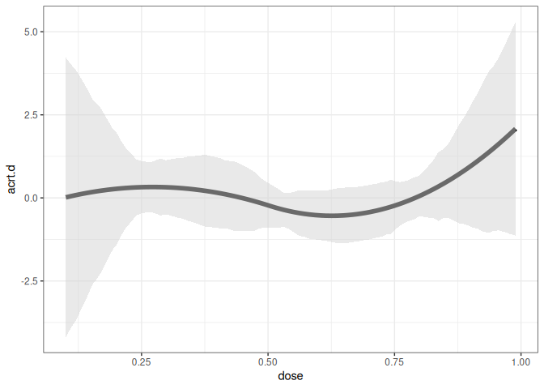
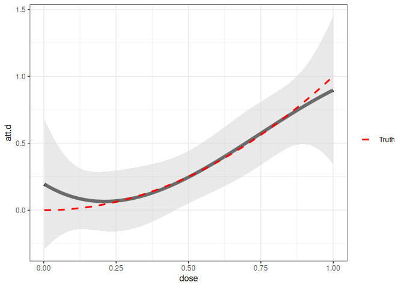

<!-- README.md is generated from README.Rmd. Please edit that file -->

# contdid

<!-- badges: start -->
<!-- badges: end -->

An R package for difference-in-differences with a continuous treatment.

## Installation

You can install the development version of contdid from
[GitHub](https://github.com/bcallaway11/contdid) with:

``` r
# install.packages("devtools")
devtools::install_github("bcallaway11/contdid")

library(contdid)
```

## Package Status: Alpha Version

This is an **alpha version** of the `contdid` package. The core features
are implemented and functional, but the package remains under active
development. The API may change, and additional functionality is
planned.

We welcome feedback and encourage users to report bugs or other issues
via the [GitHub Issues
page](https://github.com/bcallaway11/contdid/issues).

### ✅ Currently Supported

- ☑️ Continuous treatments
- ☑️ Staggered treatment adoption (i.e., more than two periods and
  variation in timing across units)
- ☑️ Aggregations into dose-specific ATT’s or ACRT’s
- ☑️ Aggregations into ATT or ACRT versions of event studies
- ☑️ User-specified flexible parametric models for treatment effects as
  a function of the dose

### 🚫 Not Yet Supported

- ❌ Discrete treatments

  - This is straightforward and could be implemented by users directly,
    but we don’t have it in the package yet.

- ⚠️ Data-driven models for treatment effects as a function of the dose

  - We have this working for cases without staggered adoption, but it is
    not yet implemented for staggered adoption. We plan to add this in
    the future.

- ❌ Repeated cross-sections data

- ❌ Unbalanced panel data

- ❌ Doses that vary over time

  - Not sure if we will ever support this, or maybe only in limited
    contexts.\_

- ❌ Including covariates

## Conceptual Setup

Below, we give several examples of how to estimate causal effect
parameters using the `contdid` package.

At a high level, the interface is basically the same as for the `did`
package and for packages that rely on the `ptetools` backend, with only
a few pieces of additional information being required. First, the name
of the continuous treatment variable should be passed through the
`dname` argument.

The `cont_did` function expects the continuous treatment variable to
behave in certain ways:

1.  It needs to be time-invariant.

2.  It should be set to its time-invariant value in pre-treatment
    periods. This is just a convention of the package, but, in
    particular, you should not have the treatment variable coded as
    being 0 in pre-treatment periods.

3.  For units that don’t participate in the treatment in any time
    period, the treatment variable just needs to be time-invariant. In
    some applications, e.g., the continuous treatment variable may be
    defined for units that don’t actually participate in the treatment.
    In other applications, it may not be defined for units that do not
    participate in the treatment. The function behaves the same way in
    either case.

Next, the other important parameters are `target_parameter`,
`aggregation`, and `treatment_type`:

- `target_parameter` can either be “level” or “slope”. If “level”, then
  the function will calculate `ATT` parameters. If set to be “slope”,
  then the function will calculate `ACRT` parameters—these are causal
  response parameters that are derivatives of the `ATT` parameters. Our
  paper [Callaway, Goodman-Bacon, and Sant’Anna
  (2024)](https://arxiv.org/abs/2107.02637) points out some
  complications for interpreting these derivative type parameters under
  the most commonly invoked version of the parallel trends assumption.

- `aggregation` can either by “eventstudy” or “dose”. For “eventstudy”,
  depending on the value of the `target_parameter` argument, the
  function will provide either the average `ATT` across different event
  times or the average `ACRT` across different event times. For “dose”,
  the function will average across all time periods and report average
  affects across different values of the continuous treatment. For the
  “dose” aggregation, results are calculated for both `ATT` and `ACRT`
  and can be displayed by providing different arguments to plotting
  functions (see example below).

- `treatment_type` can either be “continuous” or “discrete”. Currently
  only “continuous” is supported. In this case, the code proceeds as if
  the treatment really is continuous. The estimate are computed
  nonparametrically using B-splines. The user can control the number of
  knots and the degree of the B-splines using the `num_knots` and
  `degree` arguments. The defaults are `num_knots=0` and `degree=1`
  which amounts to estimating `ATT(d)` by estimating a linear model in
  the continuous treatment among treated units and subtracting the
  average outcome among the comparison units.

## Examples

With a continuous treatment, the underlying building blocks are
treatment effects that are local to a particular timing group `g` in a
particular time period `t` that experienced a particular value of the
treatment `d`. These treatment affects are relatively high-dimensional,
and most applications are likely to involve aggregating/combining these
underlying parameters. We focus on aggregations that (i) average across
timing-groups and time periods to given average treatment effect
parameters as a function of the dose `d` or (ii) averages across doses
and partially across timing group and time periods in order to give
event studies.

For the results below, we will simulate some data, where the continuous
treatment `D` has no effect on the outcome.

``` r
# Simulate data
set.seed(1234)
df <- simulate_contdid_data(
  n = 5000,
  num_time_periods = 4,
  num_groups = 4,
  dose_linear_effect = 0,
  dose_quadratic_effect = 0
)
head(df)
#>   id G          D time_period         Y
#> 1  1 2 0.08593221           1 0.3579583
#> 2  1 2 0.08593221           2 5.2354694
#> 3  1 2 0.08593221           3 3.2717079
#> 4  1 2 0.08593221           4 4.3988042
#> 5  2 4 0.17217781           1 5.9743351
#> 6  2 4 0.17217781           2 5.8463051
```

### Case 1: Dose Aggregation

The following code can be used to estimate the `ATT(d)` and `ACRT(d)`
parameters for the continuous treatment `D` using the `cont_did`
function. The `aggregation` argument is set to “dose” and the
`target_parameter` argument is set to “level” for `ATT(d)` and “slope”
for `ACRT(d)`.

``` r
cd_res <- cont_did(
  yname = "Y",
  tname = "time_period",
  idname = "id",
  dname = "D",
  data = df,
  gname = "G",
  target_parameter = "slope",
  aggregation = "dose",
  treatment_type = "continuous",
  control_group = "notyettreated",
  biters = 100,
  cband = TRUE,
  num_knots = 1,
  degree = 3,
)

summary(cd_res)
#> 
#> Overall ATT:  
#>      ATT    Std. Error     [ 95%  Conf. Int.] 
#>  -0.0265        0.0301    -0.0855      0.0325 
#> 
#> 
#> Overall ACRT:  
#>    ACRT    Std. Error     [ 95%  Conf. Int.]  
#>  0.1341        0.0485      0.039      0.2293 *
#> ---
#> Signif. codes: `*' confidence band does not cover 0
ggcont_did(cd_res, type = "att")
```


``` r
ggcont_did(cd_res, type = "acrt")
```



### Case 2: Event Study Aggregations

Next, we consider event study aggregations. The first is an event study
aggregation for `ATT`. The second is an event study aggregation for
`ACRT`.

**Event study aggregation for `ATT`:**

Notice that the target parameter is set `level` to target ATT, and the
`aggregation` argument is set to `eventstudy`.

``` r
cd_res_es_level <- cont_did(
  yname = "Y",
  tname = "time_period",
  idname = "id",
  dname = "D",
  data = df,
  gname = "G",
  target_parameter = "level",
  aggregation = "eventstudy",
  treatment_type = "continuous",
  control_group = "notyettreated",
  biters = 100,
  cband = TRUE,
  num_knots = 1,
  degree = 3,
)

summary(cd_res_es_level)
#> 
#> Overall ATT:  
#>      ATT    Std. Error     [ 95%  Conf. Int.] 
#>  -0.0243        0.0289    -0.0808      0.0323 
#> 
#> 
#> Dynamic Effects:
#>  Event Time Estimate Std. Error   [95%  Conf. Band] 
#>          -2  -0.0222     0.0504 -0.1488      0.1044 
#>          -1   0.0116     0.0271 -0.0565      0.0798 
#>           0  -0.0039     0.0299 -0.0790      0.0713 
#>           1  -0.0160     0.0397 -0.1157      0.0837 
#>           2  -0.0839     0.0419 -0.1891      0.0212 
#> ---
#> Signif. codes: `*' confidence band does not cover 0
ggcont_did(cd_res_es_level)
```


**Event study aggregation for `ACRT`:**

Relative to the previous code, notice that the target parameter is set
`slope` to target ACRT.

``` r
cd_res_es_slope <- cont_did(
  yname = "Y",
  tname = "time_period",
  idname = "id",
  dname = "D",
  data = df,
  gname = "G",
  target_parameter = "slope",
  aggregation = "eventstudy",
  treatment_type = "continuous",
  control_group = "notyettreated",
  biters = 100,
  cband = TRUE,
  num_knots = 1,
  degree = 3,
)

summary(cd_res_es_slope)
#> 
#> Overall ACRT:  
#>     ATT    Std. Error     [ 95%  Conf. Int.]  
#>  0.1341        0.0584     0.0197      0.2485 *
#> 
#> 
#> Dynamic Effects:
#>  Event Time Estimate Std. Error   [95%  Conf. Band]  
#>          -2  -0.0701     0.0808 -0.2710      0.1308  
#>          -1  -0.2212     0.0892 -0.4431      0.0007  
#>           0   0.1592     0.0586  0.0136      0.3048 *
#>           1   0.0551     0.0828 -0.1509      0.2610  
#>           2  -0.5405     0.1154 -0.8275     -0.2535 *
#> ---
#> Signif. codes: `*' confidence band does not cover 0
ggcont_did(cd_res_es_slope)
```


### Case 3: Data-Driven Nonparametric Model for Treatment Effects

In most applications, it is hard to know the correct functional form for
the treatment effects as a function of the dose. In Callaway,
Goodman-Bacon, and Sant’Anna (2025), the approach we emphasize comes
from Chen, Christensen, and Kankanala (2025), and the `contdid` package
uses their [`npiv` package](https://github.com/JeffreyRacine/npiv) to
implement this approach. Code-wise, the only thing to change is to set
the argument `dose_est_method="cck"`. \[Note that we currently only
support this option for the case with two periods and no staggered
adoption. With more periods, you can average the pre- and post-treatment
periods to reduce it to a two period case and then run the code below;
in fact, this is what we did in the application in our paper.\]

``` r
# simulate data with only two periods
# add quadratic effect to see how well we can detect it
# (note code will not "know" that the effect is quadratic)
df2 <- simulate_contdid_data(
  n = 5000,
  num_time_periods = 2,
  num_groups = 2,
  dose_linear_effect = 0,
  dose_quadratic_effect = 1
)
df2$D[df2$G == 0] <- 0
head(df2)
#>   id G        D time_period           Y
#> 1  1 2 0.890987           1  1.84272906
#> 2  1 2 0.890987           2  5.30890209
#> 3  2 0 0.000000           1  0.59423237
#> 4  2 0 0.000000           2  2.81443324
#> 5  3 0 0.000000           1  1.77438193
#> 6  3 0 0.000000           2 -0.01032246

cd_res_cck <- cont_did(
  yname = "Y",
  tname = "time_period",
  idname = "id",
  dname = "D",
  data = df2,
  gname = "G",
  target_parameter = "level",
  aggregation = "dose",
  treatment_type = "continuous",
  dose_est_method = "cck",
  control_group = "notyettreated",
  biters = 100,
  cband = TRUE,
)

summary(cd_res_cck)
#> 
#> Overall ATT:  
#>     ATT    Std. Error     [ 95%  Conf. Int.]  
#>  0.3399         0.037     0.2673      0.4125 *
#> 
#> 
#> Overall ACRT:  
#>    ACRT    Std. Error     [ 95%  Conf. Int.]  
#>  0.6595        0.1853     0.2964      1.0226 *
#> ---
#> Signif. codes: `*' confidence band does not cover 0
ggcont_did(cd_res_cck) +
  stat_function(
    fun = function(x) x^2,
    aes(color = "Truth"),
    linetype = "dashed",
    size = 1
  ) +
  scale_color_manual(values = c("Truth" = "red")) +
  labs(color = "")
```



## References

<div id="refs" class="references csl-bib-body hanging-indent">

<div id="ref-callaway-goodman-santanna-2025" class="csl-entry">

Callaway, Brantly, Andrew Goodman-Bacon, and Pedro H. C. Sant’Anna.
2025. “Difference-in-Differences with a Continuous Treatment.”

</div>

<div id="ref-chen-christensen-kankanala-2025" class="csl-entry">

Chen, Xiaohong, Timothy Christensen, and Sid Kankanala. 2025. “Adaptive
Estimation and Uniform Confidence Bands for Nonparametric Structural
Functions and Elasticities.” *Review of Economic Studies* 92 (1):
162–96.

</div>

</div>
